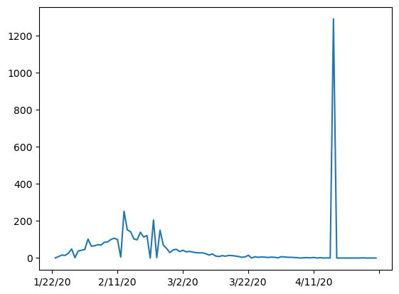
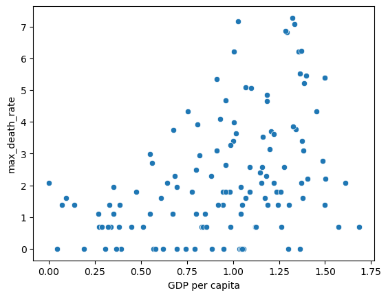
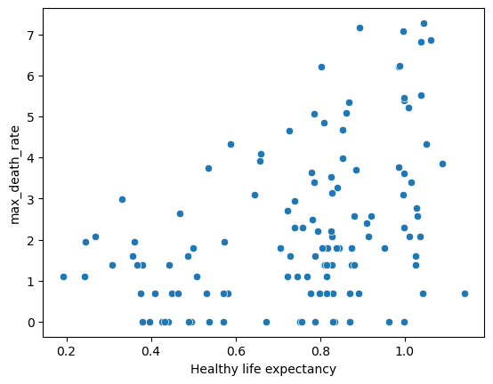

# Project_1
Data Analytics Bootcamp: Project 1

## Table of Contents
1. [Outline](#outline)
2. [Data Cleaning](#data_cleaning)
3. [How has the Happiness Score changed over the years?](#how_has_the_happiness_score_changed_over_the_years)
4. [The effect of GDP per Capita](#the_effect_of_GDP_per_Capita)
5. [The effect of Social Support, Health/Life Expectancy, and Generosity](#the_effect_of_social_support_,_health_/_life_expectancy)
6. [COVID-19 and the effect on happiness](#covid_-_19_and_the_effect_on_happiness)
7. [Limitations](#limitations)
8. [Further areas of study](#further_areas_of_study)

# Outline
The World Happiness Report, a publication by the Sustainable Development Solutions Network, driven by Gallup World Poll data, underscores the growing global demand for prioritizing happiness and well-being as key governmental benchmarks. This report explores current global happiness levels and delves into how the science of happiness elucidates variations in personal and national happiness.

Our project aims to delve into the multifaceted factors that influence happiness worldwide, considering economic, social, cultural, and population indicators. To achieve this, we will conduct an exploratory data analysis (EDA) using the data available on Kaggle to answer the following question:

_"What were the pivotal factors shaping societal well-being between 2015 and 2020, and how did these factors evolve in response to the unique challenges posed by the COVID-19 pandemic in 2020?"_

We utilized a total of seven CSV files, each corresponding to a specific year spanning from 2015 to 2020, alongside an additional CSV file dedicated to capturing COVID-related outcomes specifically for the year 2020.

# Data Cleaning
We began by importing and processing each csv file for each year. The dataset contains information about happiness scores, GDP per capita, social support, healthy life expectancy, freedom, generosity, and corruption.

We standardized column names across all CSV files, ensuring ease of access and reference for the team. Each cleaned CSV file was named according to the respective year.

The 2020 file needed to be processed seperately to drop additional columns to enable it to follow the format of the previous files.

-------------------------------------------------------------------------------------------------------------------------------------------------
# How has the Happiness Score changed over the years?
-------------------------------------------------------------------------------------------------------------------------------------------------
## Global Visualisation

### Global Happiness in 2015 (Fig 1)

### Global Happiness in 2016 (Fig 2)

### Global Happiness in 2017 (Fig 3)

### Global Happiness in 2018 (Fig 4)

### Global Happiness in 2019 (Fig 5)

### Global Happiness in 2020 (Fig 6)

Analyzing happiness scores regionally and across continents over the years reveals interesting trends. The color spectrum, ranging from green (indicating higher happiness) to red (representing lower happiness), highlights notable patterns. 

Consistently high happiness scores are observed in North America, South America, Australia, and Europe. These regions often have stable economies, strong social support systems, and high levels of personal freedom, all of which are associated with higher levels of happiness.

The presence of red and orange shades in the African continent, particularly in the central belt, aligns with the challenges many African countries face, including issues related to political instability, poverty, and limited access to healthcare and education. Additionally, conflict zones like Syria, Afghanistan, and Iraq have experienced significant declines in happiness due to the impact of wars and violence on the well-being of their populations.

South Asia generally scores lower than its Southeast Asian counterparts, while Eastern Asia maintains a steady average happiness score of around 5, which may reflect the influence of cultural and societal norms.
In Europe, Western European countries consistently score high in happiness, thanks to robust economies and social safety nets. Central and Eastern European nations have made progress since the end of the Cold War, though some, like Ukraine, Bulgaria, and Georgia, still report scores averaging between 4 and 5.

## Mean Happiness Scores from 2015 to 2020 (Fig 7)

### Mean Happiness Score with 95% confidence intervals (Fig 8)

The most notable trend of the happiness score over 2015 to 2020 is it’s stability, hovering around 5.38m, with slight fluctuations, mainly in the years 2019-2020 where a very small increase in the Happiness score can be seen (Fig 7). . The confidence intervals shown in Fig 8 suggest that the variability in the mean happiness scores was not significant.

The lowest observed Happiness Score during this period was 2.5669, emphasizing moments of profound unhappiness, while the highest score reached an impressive 7.8087, both in the year 2020, underscoring the capacity for exceptional well-being ad variability in the dataset.

This stability emphasizes the resilience of overall happiness and the need for a holistic approach to improving well-being that goes beyond single indicators.

## Contribution of other variables to Happiness Score

### Mean GDP per Capita with 95% confidence intervals

GDP per Capita, an indicator of economic prosperity, shows a consistent positive correlation with the Happiness Score. Countries with higher GDP per Capita generally report higher happiness levels. Over the six years, there is a general upward trend in GDP per Capita, indicating global economic growth. However, the rate of increase varies from year to year. High-ranking countries have GDP per Capita values typically above 1.3, while low-ranking countries often have values below 0.5, demonstrating the strong link between economic prosperity and happiness.

### Mean Social Support with 95% confidence intervals

Social Support, which measures the presence of strong social networks, demonstrates a strong positive correlation with the Happiness Score. Nations with robust social support structures tend to have happier populations. While there are some minor fluctuations, the mean Social Support remains relatively consistent, suggesting the enduring importance of social networks in promoting well-being.

### Mean Health/Life Expectancy with 95% confidence intervals

Life Expectancy/Health, an indicator of overall health and access to healthcare, positively influences happiness. Countries with better health outcomes report higher happiness scores. Over the years, there is a slight overall increase in Life Expectancy/Health, which aligns with global improvements in healthcare access and life expectancy. High-ranking countries have life expectancies around 0.9 or higher, while low-ranking countries have life expectancies often well below 0.3, emphasizing the importance of health in happiness.

### Mean Freedom with 95% confidence intervals

Freedom, representing personal liberties and civil rights, shows a consistent positive correlation with happiness. Nations with greater freedoms tend to have higher happiness scores. While there are minor fluctuations, the overall trend in Freedom remains relatively stable across the years. High-ranking countries exhibit high levels of freedom (e.g., Switzerland with 0.66557), while some low-ranking countries have lower freedom scores (e.g., Chad with 0.23501).

### Mean Trust in Goverment with 95% confidence intervals

Trust in Government, which reflects the perception of government integrity, negatively correlates with happiness. Countries with lower levels of trust in government tend to report lower happiness scores. Over the years, Trust in Government Corruption experiences slight fluctuations, reflecting shifts in public perception of government integrity. Trust in government varies significantly but is generally moderate to high in top-ranking countries (e.g., Switzerland with 0.41978) and often lower in low-ranking countries (e.g., Chad with 0.05269).

### Mean Generosity with 95% confidence intervals

Generosity, measuring charitable behaviour and giving, exhibits a more mixed relationship with the Happiness Score. While there is often a positive correlation, it is weaker and less consistent than other factors. Generosity levels show minor variations over the years, suggesting that its impact on overall happiness may be less pronounced compared to factors like social support or health. Generosity levels vary but are generally moderate to high in both top and bottom countries (e.g., Switzerland with 0.29678, Chad with 0.18386), indicating a willingness to contribute to well-being.

------------------------------------------------------------------------------------------------------
# The effect of GDP per Capita
------------------------------------------------------------------------------------------------------
## How does GDP per Capita effect each variable in the World Happiness Report?

### Top 10 GDP per Capita Countries

Trends in Mean GDP per Capita: The mean GDP per capita for the top 10 
countries seems to fluctuate over the years. It increased from 2015 to 
2016, then had a slight decrease in 2017, increased again in 2018, 
remained relatively stable in 2019, and decreased in 2020. These changes
can indicate economic growth or contraction in these countries over time.
Standard Deviation: The standard deviation represents the dispersion of 
data points around the mean. A higher standard deviation suggests 
greater variability in GDP per capita among the top 10 countries. In this 
case, the standard deviation is relatively low for most years, indicating 
that the GDP per capita values are clustered around the mean, indicating 
relatively stable and similar economic conditions among these countries
Minimum and Maximum Values: The minimum and maximum values show 
the range of GDP per capita in the top 10 countries for each year. These 
values can highlight the most and least prosperous countries in the top 
10. For example, in 2018, there is a relatively high maximum value, 
indicating that one or more countries in the top 10 had a significantly 
higher GDP per capita compared to others.

### Bottom 10 GDP per Capita Countries 

Consistency in Low GDP: It's evident that the countries in the bottom 10 
consistently have very low GDP per capita across all years. This suggests 
ongoing economic challenges in these countries, which could include 
poverty, limited access to resources, and reduced standards of living.
Variability in Happiness Score: Despite having low GDP per capita, there is
some variability in the "Happiness Score" among these countries. This 
indicates that factors other than economic wealth, such as social support, 
life expectancy, freedom, trust in government, and generosity, play a 
significant role in determining the overall well-being and happiness of a 
population.

Persistent Issues: Some countries, such as Congo (Kinshasa), Burundi, and
Niger, appear in the bottom 10 consistently over multiple years. This 
suggests that these countries face ongoing challenges in improving their 
economic conditions and overall well-being.
Social Support and Health: It's worth noting that in some years, despite 
low GDP per capita, certain countries have relatively higher scores in 
"Social Support" and "Life Expectancy/Health." This indicates that social 
and health-related factors may have a more significant impact on 
happiness and well-being in these contexts.

Trust and Corruption: Trust in government and levels of government 
corruption (measured as "Trust (government corruption)") also vary 
among these countries. Some countries have very low levels of trust in 
government, which can affect their overall happiness and stability.
Generosity: "Generosity" is another variable that varies among these 
countries. This suggests differences in social and cultural norms related to
generosity and community support

### Scatter Plots of Capita vs Happiness/Attributes 

These scatter plots visually depict the associations between GDP and both
happiness and various attributes. Notably, the correlation between GDP 
and the Happiness score was a robust 0.79, indicating a strong and 
positive linear relationship between these two variables. Similarly, positive
correlations were observed between GDP and other attributes such as 
social support, life expectancy, and freedom. However, it's worth noting 
that the correlation between generosity and GDP was notably weak, 
implying a limited connection between these two variables.

### Box plot and Heat Map Analysis 

The box plots vividly demonstrate a notable disparity in Happiness scores,
with lower-ranked GDP countries exhibiting significantly greater variance. 
In contrast, countries with higher GDP per capita displayed considerably 
less variance, signifying greater stability. These findings underscore the 
substantial variability in happiness scores among countries with lower per 
capita GDP, juxtaposed with the comparatively stable happiness levels 
observed in higher GDP countries.The heat map further consolidates the 
prior findings and shows GDP per capita has positive correlation with 
majority of the attributes, excluding generosity and government 
corruption.

------------------------------------------------------------------------------------------------------
# The effect of Social Support, Health/Life Expectancy, and Generosity
------------------------------------------------------------------------------------------------------
## How do socio-cultural factors influence the various variables assessed in the World Happiness Report?

In this analysis, we investigated the trends in Happiness Scores among various regions and countries from 2015 to 2020. 
Our findings indicate that there is a consistent pattern with minor fluctuations over the years. 
Notably, North America, ANZ, and Western Europe emerged as top-performing regions in terms of Happiness Scores, which were strongly associated with high GDP and social support.

We presented our findings through regional bar plots and heatmap analyses to visually represent the data.

## Correlation Analysis:

Our correlation analysis revealed significant relationships between different variables. Social support and life expectancy/health exhibited a robust positive correlation not only with each other but also with most other attributes. However, generosity displayed weak or negligible correlations with other factors.
Specifically, we found that:
•    Social support and happiness scores were strongly correlated with a coefficient of 0.7.
•    Social support and life expectancy/health exhibited a strong correlation with a coefficient of 0.5.
•    Social support and freedom displayed a solid correlation with a coefficient of 0.4.
•    Social support and generosity demonstrated a weak correlation with a coefficient of 0.1.
•    Happiness scores and life expectancy/health displayed a robust correlation with a coefficient of 0.7.
•    Life expectancy/health and freedom also exhibited a strong correlation with a coefficient of 0.4.
•    Life expectancy/health and generosity had a very weak correlation with a coefficient of 0.1.

## Scatter Plot and Regression Analysis 

Furthermore, we conducted scatter plots and regression analyses to delve deeper into the relationships between specific variables. Notably, we found:

•    A strong positive correlation (coefficient of 0.75) between social support and happiness scores.
•    A strong positive correlation (coefficient of 0.78) between life expectancy/health and happiness scores.
•    A weak correlation (coefficient of 0.14) between generosity and happiness scores.

Conclusion:
In summary, our analysis highlights robust positive correlations between Happiness Scores, life expectancy/health, and social support. 
These findings suggest that countries with higher levels of economic prosperity, social support systems, and healthier life expectancies tend to score higher on the Happiness Index. 
However, it's essential to acknowledge that further research is necessary to comprehensively grasp the underlying factors driving these correlations.

------------------------------------------------------------------------------------------------------------------------------------------
# COVID-19 and the effect on happiness
------------------------------------------------------------------------------------------------------------------------------------------
## Key findings
**GDP and Happiness:**
We found a significant association between a country's GDP and its reported happiness. Countries with higher GDP tend to have a more favorable happiness score.

**GDP and Social Support:**
We found that there is no significant association between the GDP and Social Support .Countries with higher GDP tend to have a less Social Support.

**Happiness Score and Generosity:**
We found that there is no significant association between the Happiness Score  and Generosity .Countries with higher Happiness Score tend to have a less Generosity.

**Government Corruption Perception**
Countries with a lower perception of government corruption were likely to have a more positive outlook on happiness, suggesting the importance of transparent and accountable governance.

**Life Expectancy and COVID-19:**
Although not directly analyzed in this dataset, life expectancy is a vital indicator of overall health and well-being, likely affecting how countries handle the pandemic.

**Social Support and COVID-19:**

Strong social support seems to correlate with better compliance with preventive measures, potentially contributing to lower COVID-19 transmission rates.

While GDP, corruption perception, life expectancy, and social support are vital factors, managing a pandemic like COVID-19 is a multidimensional challenge. It requires a holistic approach, considering healthcare infrastructure, public health policies, education, cultural factors, and more.

Understanding these relationships is crucial for policymakers and public health experts in crafting effective strategies to combat the current pandemic and future health crises. By addressing these factors, we can work towards a more resilient and healthier global community.

---

## Graphs Overview:

- **Scatter Plot: GDP vs. Happiness**
  - Showed the positive correlation between a country's GDP and reported happiness.

- **Box Plot: Happiness Distribution by Corruption Perception**
  - Illustrated the relationship between corruption perception and happiness scores.

- **Heatmap: Correlation Matrix**
  - Displayed the correlation coefficients among the variables in the dataset.

- **Geo Plots: Healthy Life Expectancy and COVID-19 Cases**
  - Explored the geographical representation of life expectancy and COVID-19 cases.

---

By analyzing these aspects, we gain valuable insights into the complexities of managing a global health crisis like COVID-19 and can develop more informed strategies for a healthier and happier society.

##########################################################################################################################################################################################################

# COVID19 Death / Happiness Report Data Analysis

In this project, we perform an in-depth analysis of COVID-19 death data alongside happiness report data from different countries. Our goal is to explore potential relationships and insights between the COVID-19 pandemic's impact on countries and their citizens' reported happiness.

## Table of Contents
1. [Introduction](#introduction)
2. [Data Import](#data-import)
3. [Data Visualization](#data-visualization)
4. [Correlation Analysis](#correlation-analysis)
5. [Conclusion](#conclusion)

---

## Introduction

The year 2020 brought unprecedented challenges to the world, primarily due to the COVID-19 pandemic. While the pandemic itself had a direct impact on public health, it also had indirect consequences on various aspects of society, including people's overall well-being and happiness. This analysis aims to shed light on the relationship between the severity of COVID-19 outbreaks in different countries and their respective happiness levels.

---

## Data Import 

### COVID-19 Death Dataset

We start by importing and preprocessing the COVID-19 death dataset. The dataset contains information about COVID-19 deaths in various countries and regions. We clean and aggregate the data to make it suitable for analysis.

### Worldwide Happiness Report

Next, we import the Worldwide Happiness Report, which includes happiness scores and various factors contributing to happiness, such as GDP per capita, social support, healthy life expectancy, and freedom to make life choices. We also clean and prepare this dataset for analysis.

---

## Data Visualization

### COVID-19 Death Progression in Specific Countries

We begin our analysis by visualizing the progression of COVID-19 deaths in specific countries. The graph below illustrates the death toll over time for selected countries, offering insights into how the pandemic evolved in different regions.

### Rate of COVID-19 Death Curve

To understand the rate of change in COVID-19 deaths, we present the death rate curve. This curve shows how quickly or slowly COVID-19 deaths increased in specific countries, allowing us to identify trends and critical periods.

### Maximum COVID-19 Death Rate

We identify and list the maximum death rates observed for specific countries. This information provides a glimpse into the most challenging periods these countries faced during the pandemic.

### Scatter Plot: Correlation between Covid19 Deaths and Happiness KPIs

Moving beyond COVID-19 data, we explore the correlation between GDP per capita and happiness scores. The scatter plot below illustrates this relationship, highlighting how economic prosperity might influence people's happiness.

---

The correlation values provide insights into how these factors might influence the severity of COVID-19 outbreaks in different countries.

---

## Conclusion

This analysis offers a comprehensive look at the interplay between the COVID-19 pandemic and happiness levels across different countries. By visualizing COVID-19 death progression, identifying critical periods, and exploring correlations with various factors, we aim to contribute to a better understanding of the pandemic's broader impact on societies.

Feel free to further explore the data and analysis in the accompanying Jupyter Notebook.

## Limitations of the study
The World Happiness Report data, like any dataset, has its limitations. Some of the key limitations include:

**Subjectivity:** Happiness is a highly subjective and culturally influenced concept. Respondents' interpretations of happiness can vary significantly across cultures and individuals, making it challenging to standardize measurements.

**Self-Reporting Bias:** The data relies on self-reported surveys, which are susceptible to response bias. Respondents may provide answers they believe are socially desirable or may not accurately assess their own well-being.

**Cross-Cultural Differences:** Happiness is culturally and contextually dependent, and what constitutes happiness in one culture may not apply universally. This can lead to challenges in comparing happiness levels across different countries.

**Limited Scope:** The report primarily focuses on a few key factors such as GDP per capita, social support, healthy life expectancy, freedom, generosity, and corruption. It may not capture the full spectrum of factors that influence happiness, such as cultural, environmental, or personal factors.

**Data Collection Challenges:** Gathering data from diverse countries and cultures can be challenging. Some nations may have less reliable or comprehensive data collection systems, leading to potential data gaps.

**Lack of Causality:** The report provides correlations between happiness and various factors but does not establish causation. It may not always be clear whether an increase in one variable directly leads to increased happiness.

**Yearly Snapshot:** The report provides a snapshot of happiness for a specific year. It may not capture long-term trends or fluctuations in happiness over time. This is especially pertinent when comparing datasets pre and post COVID-19.

**Political and Social Factors:** Political and social stability can significantly affect happiness, and these factors may not always be adequately accounted for in the data.

**Data Manipulation:** In some cases, governments may manipulate data to present a more positive image of their country's happiness and well-being, potentially affecting the accuracy of the results.

**Sample Size and Representativeness:** The representativeness of the survey samples and the sample sizes can vary across countries, which may affect the reliability and generalizability of the results.

## Further areas of study
1. Global Events and Happiness: Analyze how major global events, such as pandemics, economic crises, or natural disasters, impact happiness and resilience. For example, wars or including more datasets in the COVID-19 years.
2. Cultural Variations in Happiness: Investigate how cultural norms and values influence the perception and pursuit of happiness across different societies.

